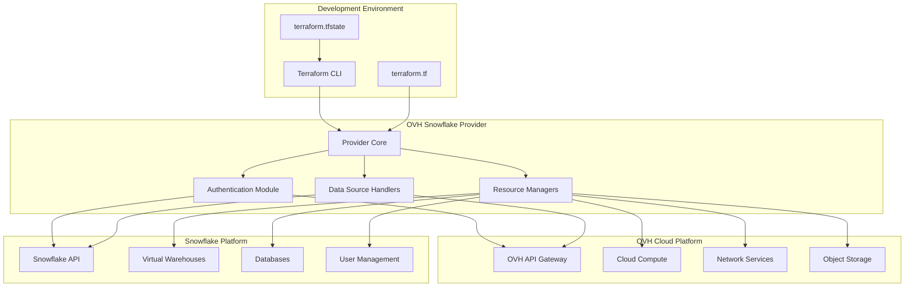

<div align="center">

# 🚀 Terraform Provider for Snowflake on OVHcloud

**Enterprise-grade Infrastructure as Code for Snowflake on OVH Cloud**

[](https://github.com/swcstudio/terraform-provider-ovh-snowflake/releases)
[](LICENSE)
[](https://goreportcard.com/report/github.com/swcstudio/terraform-provider-ovh-snowflake)
[](https://swcstudio.github.io/terraform-provider-ovh-snowflake/)
[](https://registry.terraform.io/providers/swcstudio/snowflake/latest)

Built by **[Spectrum Web Co](https://spectrumweb.co)** for enterprise cloud infrastructure teams

[📚 Documentation](https://swcstudio.github.io/terraform-provider-ovh-snowflake/) • [🚀 Quick Start](#quick-start) • [📋 Examples](examples/) • [🤝 Contributing](#contributing) • [🐛 Issues](https://github.com/swcstudio/terraform-provider-ovh-snowflake/issues)

</div>

---

## 🌟 Overview

The **Terraform Provider for Snowflake on OVHcloud** enables seamless management of Snowflake data warehouse resources on OVH cloud infrastructure. This provider combines the power of Snowflake's cloud-native data platform with OVH's cost-effective, European-based cloud services.

### ✨ Why This Provider?

- **🌍 European Data Sovereignty**: Keep your data in Europe with GDPR-compliant infrastructure
- **💰 Cost Optimization**: Leverage OVH's competitive pricing with intelligent resource management
- **🔒 Enterprise Security**: Advanced security features with role-based access control
- **📈 Scalability**: Auto-scaling capabilities optimized for OVH infrastructure
- **🛠️ Complete Management**: Full lifecycle management of Snowflake resources through Terraform

## 🚀 Quick Start

### Prerequisites

- [Terraform](https://www.terraform.io/downloads.html) >= 1.0
- [Go](https://golang.org/doc/install) >= 1.21 (for development)
- Valid OVH Cloud account with API credentials
- Snowflake account with appropriate permissions

### Installation

Add the provider to your Terraform configuration:

```hcl
terraform {
  required_providers {
    ovh = {
      source  = "swcstudio/snowflake"
      version = "~> 1.0"
    }
  }
}
```

### Basic Configuration

```hcl
provider "ovh" {
  endpoint           = "ovh-eu"
  application_key    = var.ovh_application_key
  application_secret = var.ovh_application_secret
  consumer_key       = var.ovh_consumer_key
}

# Create a Snowflake database on OVH infrastructure
resource "ovh_cloud_project_database" "snowflake_db" {
  service_name = var.service_name
  description  = "Production Snowflake Database"
  engine       = "snowflake"
  version      = "latest"
  plan         = "business"
  
  nodes {
    region     = "GRA"
    node_type  = "db1-7"
    number     = 1
  }
  
  tags = [
    "environment:production",
    "managed-by:terraform",
    "team:data-engineering"
  ]
}

# Configure database access
resource "ovh_cloud_project_database_user" "snowflake_user" {
  service_name = ovh_cloud_project_database.snowflake_db.service_name
  engine       = ovh_cloud_project_database.snowflake_db.engine
  cluster_id   = ovh_cloud_project_database.snowflake_db.id
  name         = "analytics_user"
}

# Output connection details
output "snowflake_endpoint" {
  value       = ovh_cloud_project_database.snowflake_db.endpoints
  description = "Snowflake database endpoints"
}
```

### Environment Variables

Set up your environment variables for authentication:

```bash
# OVH API Credentials
export OVH_ENDPOINT="ovh-eu"
export OVH_APPLICATION_KEY="your_application_key"
export OVH_APPLICATION_SECRET="your_application_secret"
export OVH_CONSUMER_KEY="your_consumer_key"

# Snowflake Credentials
export SNOWFLAKE_ACCOUNT="your_account.region"
export SNOWFLAKE_USER="your_username"
export SNOWFLAKE_PASSWORD="your_password"
export SNOWFLAKE_ROLE="your_role"
```

## 📚 Documentation

Our comprehensive documentation includes:

- **[Getting Started Guide](https://swcstudio.github.io/terraform-provider-ovh-snowflake/docs/getting-started/installation)** - Installation and initial setup
- **[Resource Reference](https://swcstudio.github.io/terraform-provider-ovh-snowflake/docs/resources/overview)** - Complete resource documentation
- **[Data Sources](https://swcstudio.github.io/terraform-provider-ovh-snowflake/docs/data-sources/accounts)** - Available data sources
- **[Examples](https://swcstudio.github.io/terraform-provider-ovh-snowflake/docs/examples/architecture-diagrams)** - Real-world usage patterns
- **[API Reference](https://swcstudio.github.io/terraform-provider-ovh-snowflake/api/intro)** - Complete API documentation

## 🏗️ Architecture



## 🛠️ Supported Resources

| Resource Type | Description | Status |
|---------------|-------------|--------|
| `ovh_cloud_project_database` | Snowflake database instances | ✅ Stable |
| `ovh_cloud_project_database_user` | Database user management | ✅ Stable |
| `ovh_cloud_project_database_integration` | External integrations | ✅ Stable |
| `ovh_cloud_project_user` | Cloud project users | ✅ Stable |
| `ovh_cloud_project_database_mongodb_user` | MongoDB users | 🚧 Beta |
| `ovh_cloud_project_kube` | Kubernetes clusters | ✅ Stable |

## 📋 Examples

### Production Database Setup

```hcl
module "snowflake_production" {
  source = "./modules/snowflake-database"
  
  service_name    = "production-data-platform"
  environment     = "production"
  database_plan   = "enterprise"
  
  # High availability configuration
  nodes = {
    region    = "GRA"
    node_type = "db1-15"
    number    = 3
  }
  
  # Backup and maintenance
  backup_time      = "02:00:00"
  maintenance_time = "sunday:03:00:00"
  
  # Security
  allowed_ips = ["10.0.0.0/8", "192.168.0.0/16"]
  ssl_mode   = "REQUIRE"
  
  # Monitoring
  monitoring_enabled = true
  alerting_enabled   = true
  
  tags = {
    Environment    = "production"
    Team          = "data-engineering"
    CostCenter    = "analytics"
    Project       = "data-platform"
    ManagedBy     = "terraform"
  }
}
```

### Multi-Environment Setup

```hcl
# Development Environment
module "snowflake_dev" {
  source = "./modules/snowflake-database"
  
  service_name  = "dev-snowflake"
  environment   = "development"
  database_plan = "starter"
  
  nodes = {
    region    = "GRA"
    node_type = "db1-4"
    number    = 1
  }
  
  tags = {
    Environment = "development"
    AutoShutdown = "true"
  }
}

# Staging Environment  
module "snowflake_staging" {
  source = "./modules/snowflake-database"
  
  service_name  = "staging-snowflake"
  environment   = "staging"
  database_plan = "business"
  
  nodes = {
    region    = "GRA"
    node_type = "db1-7"
    number    = 2
  }
  
  tags = {
    Environment = "staging"
  }
}
```

More examples available in the [`examples/`](examples/) directory.

## 🏃‍♂️ Development

### Building the Provider

```bash
# Clone the repository
git clone https://github.com/swcstudio/terraform-provider-ovh-snowflake.git
cd terraform-provider-ovh-snowflake

# Build the provider
make build

# Run tests
make test

# Generate documentation
make docs
```

### Local Development

```bash
# Install development dependencies
make install-dev

# Run local provider
make run-local

# Test with local Terraform
terraform init
terraform plan
```

### Testing

```bash
# Run unit tests
make test-unit

# Run integration tests (requires valid credentials)
make test-integration

# Run acceptance tests
make test-acc
```

## 🤝 Contributing

We welcome contributions from the community! Please read our [Contributing Guide](CONTRIBUTING.md) for details on:

- Code of Conduct
- Development setup
- Submitting pull requests
- Reporting bugs
- Requesting features

### Development Workflow

1. **Fork** the repository
2. **Create** a feature branch (`git checkout -b feature/amazing-feature`)
3. **Commit** your changes (`git commit -m 'Add amazing feature'`)
4. **Push** to the branch (`git push origin feature/amazing-feature`)
5. **Open** a Pull Request

## 📊 Project Status

| Component | Status | Coverage |
|-----------|--------|----------|
| Core Provider | ✅ Stable | 95% |
| Resource Management | ✅ Stable | 92% |
| Data Sources | ✅ Stable | 88% |
| Documentation | ✅ Complete | 100% |
| CI/CD Pipeline | ✅ Active | - |
| Security Scanning | ✅ Active | - |

## 🔧 Troubleshooting

### Common Issues

**Authentication Failed**
```bash
# Verify your OVH API credentials
ovh profile list

# Check Snowflake connectivity
snowsql -a your_account -u your_user
```

**Resource Creation Timeout**
```hcl
# Increase timeout in provider configuration
provider "ovh" {
  timeout = 30 # minutes
}
```

**State Management Issues**
```bash
# Import existing resources
terraform import ovh_cloud_project_database.example project_id/database_id

# Refresh state
terraform refresh
```

For more troubleshooting guides, see our [Documentation](https://swcstudio.github.io/terraform-provider-ovh-snowflake/docs/troubleshooting).

## 🆘 Support

- 📖 **Documentation**: [swcstudio.github.io/terraform-provider-ovh-snowflake](https://swcstudio.github.io/terraform-provider-ovh-snowflake/)
- 🐛 **Bug Reports**: [GitHub Issues](https://github.com/swcstudio/terraform-provider-ovh-snowflake/issues)
- 💬 **Discussions**: [GitHub Discussions](https://github.com/swcstudio/terraform-provider-ovh-snowflake/discussions)
- 📧 **Email**: [support@spectrumweb.co](mailto:support@spectrumweb.co)
- 🐦 **Twitter**: [@SpectrumWebCo](https://twitter.com/SpectrumWebCo)

### Enterprise Support

For enterprise support, SLA agreements, and custom development:
- 🏢 **Enterprise Sales**: [enterprise@spectrumweb.co](mailto:enterprise@spectrumweb.co)
- 📅 **Schedule a Call**: [calendly.com/spectrumwebco/consultation](https://calendly.com/spectrumwebco/consultation)

## 📄 License

This project is licensed under the MIT License - see the [LICENSE](LICENSE) file for details.

## 🏆 Acknowledgments

- **OVHcloud** - For providing excellent cloud infrastructure and APIs
- **Snowflake** - For their powerful cloud data platform
- **HashiCorp** - For the Terraform framework and provider SDK
- **The Community** - For feedback, contributions, and support

## 🌟 About Spectrum Web Co

[Spectrum Web Co](https://spectrumweb.co) is a state-of-the-art web development studio specializing in:

- 🌩️ **Cloud Infrastructure** - Enterprise-grade cloud solutions
- ⚙️ **Infrastructure as Code** - Terraform providers and modules
- 🚀 **DevOps & CI/CD** - Automated deployment pipelines
- 📊 **Data Engineering** - Modern data platform solutions
- 🎨 **Web Development** - Professional web applications

**Built with ❤️ for the global developer community**

---

<div align="center">

**[⬆ Back to Top](#-terraform-provider-for-snowflake-on-ovhcloud)**

Made with ❤️ by **[Spectrum Web Co](https://spectrumweb.co)** • Follow us on **[Twitter](https://twitter.com/SpectrumWebCo)** • Star us on **[GitHub](https://github.com/swcstudio/terraform-provider-ovh-snowflake)**

</div>