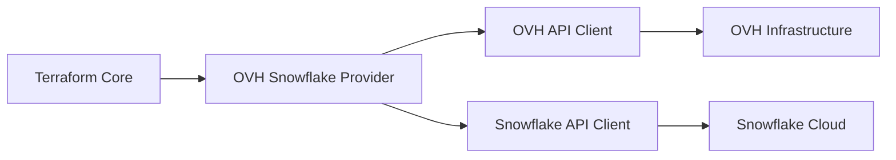

# API Reference

Welcome to the OVH Snowflake Terraform Provider API Reference. This section provides comprehensive documentation for developers who want to understand the underlying API interactions, extend the provider, or integrate with it programmatically.

## Overview

The OVH Snowflake Terraform Provider acts as a bridge between Terraform and two primary API systems:

- **OVH API**: For infrastructure management and routing
- **Snowflake REST API**: For data warehouse operations

### Architecture



## API Clients

### OVH API Client

The provider uses the OVH API for:
- Authentication and session management
- Infrastructure provisioning
- Network configuration
- Monitoring and logging

**Base URL**: `https://api.ovh.com/1.0/`

**Authentication**: API Key + Application Secret + Consumer Key

### Snowflake REST API

The provider uses Snowflake's REST API for:
- Database and schema management
- User and role administration
- Warehouse operations
- Query execution

**Base URL**: `https://<account>.snowflakecomputing.com/api/v2/`

**Authentication**: JWT Token (Key Pair Authentication)

## Authentication Flow

### 1. OVH Authentication

```go
type OVHClient struct {
    endpoint          string
    applicationKey    string
    applicationSecret string
    consumerKey       string
    client           *ovh.Client
}

func (c *OVHClient) Authenticate() error {
    client, err := ovh.NewClient(
        c.endpoint,
        c.applicationKey,
        c.applicationSecret,
        c.consumerKey,
    )
    if err != nil {
        return fmt.Errorf("failed to create OVH client: %w", err)
    }
    c.client = client
    return nil
}
```

### 2. Snowflake Authentication

```go
type SnowflakeClient struct {
    account    string
    user       string
    privateKey string
    region     string
    client     *sf.Client
}

func (c *SnowflakeClient) Authenticate() error {
    config := &sf.Config{
        Account:    c.account,
        User:       c.user,
        PrivateKey: c.privateKey,
        Region:     c.region,
    }
    
    client, err := sf.NewClient(config)
    if err != nil {
        return fmt.Errorf("failed to create Snowflake client: %w", err)
    }
    c.client = client
    return nil
}
```

## Core API Operations

### Resource Management

Each Terraform resource maps to specific API operations:

| Operation | OVH API Call | Snowflake API Call |
|-----------|--------------|-------------------|
| Create | Infrastructure provisioning | Resource creation |
| Read | Status/config retrieval | Resource query |
| Update | Configuration update | Resource modification |
| Delete | Resource cleanup | Resource removal |

### Example: Database Resource

```go
type DatabaseResource struct {
    ovhClient       *OVHClient
    snowflakeClient *SnowflakeClient
}

func (r *DatabaseResource) Create(ctx context.Context, req resource.CreateRequest, resp *resource.CreateResponse) {
    var data DatabaseResourceModel
    
    // Parse Terraform configuration
    diags := req.Config.Get(ctx, &data)
    resp.Diagnostics.Append(diags...)
    if resp.Diagnostics.HasError() {
        return
    }
    
    // Step 1: Setup OVH infrastructure
    infraConfig := &OVHInfraRequest{
        DatabaseName: data.Name.ValueString(),
        Region:       data.Region.ValueString(),
    }
    
    infraResp, err := r.ovhClient.CreateDatabaseInfrastructure(ctx, infraConfig)
    if err != nil {
        resp.Diagnostics.AddError("OVH Infrastructure Error", err.Error())
        return
    }
    
    // Step 2: Create Snowflake database
    dbConfig := &SnowflakeDatabaseRequest{
        Name:    data.Name.ValueString(),
        Comment: data.Comment.ValueString(),
    }
    
    dbResp, err := r.snowflakeClient.CreateDatabase(ctx, dbConfig)
    if err != nil {
        // Cleanup OVH infrastructure on failure
        r.ovhClient.DeleteDatabaseInfrastructure(ctx, infraResp.ID)
        resp.Diagnostics.AddError("Snowflake Database Error", err.Error())
        return
    }
    
    // Update Terraform state
    data.ID = types.StringValue(dbResp.ID)
    data.InfrastructureID = types.StringValue(infraResp.ID)
    
    diags = resp.State.Set(ctx, &data)
    resp.Diagnostics.Append(diags...)
}
```

## API Endpoints

### OVH API Endpoints

#### Infrastructure Management
- `POST /cloud/project/{projectId}/database/snowflake` - Create infrastructure
- `GET /cloud/project/{projectId}/database/snowflake/{id}` - Get infrastructure details
- `PUT /cloud/project/{projectId}/database/snowflake/{id}` - Update infrastructure
- `DELETE /cloud/project/{projectId}/database/snowflake/{id}` - Delete infrastructure

#### Monitoring
- `GET /cloud/project/{projectId}/database/snowflake/{id}/metrics` - Get metrics
- `GET /cloud/project/{projectId}/database/snowflake/{id}/logs` - Get logs

### Snowflake API Endpoints

#### Database Operations
- `POST /api/v2/databases` - Create database
- `GET /api/v2/databases/{name}` - Get database details
- `PUT /api/v2/databases/{name}` - Update database
- `DELETE /api/v2/databases/{name}` - Delete database

#### Schema Operations
- `POST /api/v2/databases/{db}/schemas` - Create schema
- `GET /api/v2/databases/{db}/schemas/{name}` - Get schema details
- `PUT /api/v2/databases/{db}/schemas/{name}` - Update schema
- `DELETE /api/v2/databases/{db}/schemas/{name}` - Delete schema

#### User Management
- `POST /api/v2/users` - Create user
- `GET /api/v2/users/{name}` - Get user details
- `PUT /api/v2/users/{name}` - Update user
- `DELETE /api/v2/users/{name}` - Delete user

## Error Handling

### Error Types

```go
type APIError struct {
    Code    string `json:"code"`
    Message string `json:"message"`
    Details string `json:"details,omitempty"`
}

func (e *APIError) Error() string {
    return fmt.Sprintf("%s: %s", e.Code, e.Message)
}
```

### Common Error Codes

| Code | Description | Resolution |
|------|-------------|------------|
| `AUTH_FAILED` | Authentication failure | Check credentials |
| `RESOURCE_NOT_FOUND` | Resource doesn't exist | Verify resource name |
| `PERMISSION_DENIED` | Insufficient permissions | Check role assignments |
| `RATE_LIMIT_EXCEEDED` | Too many requests | Implement backoff |
| `NETWORK_ERROR` | Connection failure | Check network connectivity |

### Error Handling Strategy

```go
func (c *Client) handleError(err error, operation string) error {
    var apiErr *APIError
    if errors.As(err, &apiErr) {
        switch apiErr.Code {
        case "RATE_LIMIT_EXCEEDED":
            return c.retryWithBackoff(operation)
        case "AUTH_FAILED":
            return c.reauthenticate()
        default:
            return fmt.Errorf("API operation failed: %w", apiErr)
        }
    }
    return fmt.Errorf("unexpected error in %s: %w", operation, err)
}
```

## Rate Limiting

### OVH API Rate Limits
- **Standard**: 10 requests/second
- **Burst**: 100 requests/minute
- **Daily**: 10,000 requests/day

### Snowflake API Rate Limits
- **Query API**: 100 requests/minute
- **Management API**: 1,000 requests/hour
- **Bulk Operations**: 10 requests/minute

### Rate Limiting Implementation

```go
type RateLimiter struct {
    requests chan struct{}
    ticker   *time.Ticker
}

func NewRateLimiter(requestsPerSecond int) *RateLimiter {
    rl := &RateLimiter{
        requests: make(chan struct{}, requestsPerSecond),
        ticker:   time.NewTicker(time.Second / time.Duration(requestsPerSecond)),
    }
    
    go func() {
        for range rl.ticker.C {
            select {
            case rl.requests <- struct{}{}:
            default:
            }
        }
    }()
    
    return rl
}

func (rl *RateLimiter) Wait() {
    <-rl.requests
}
```

## Data Models

### Resource Models

```go
type DatabaseResourceModel struct {
    ID               types.String `tfsdk:"id"`
    Name             types.String `tfsdk:"name"`
    Comment          types.String `tfsdk:"comment"`
    InfrastructureID types.String `tfsdk:"infrastructure_id"`
    Region           types.String `tfsdk:"region"`
    CreatedAt        types.String `tfsdk:"created_at"`
    UpdatedAt        types.String `tfsdk:"updated_at"`
}

type SchemaResourceModel struct {
    ID           types.String `tfsdk:"id"`
    DatabaseName types.String `tfsdk:"database_name"`
    Name         types.String `tfsdk:"name"`
    Comment      types.String `tfsdk:"comment"`
    IsTransient  types.Bool   `tfsdk:"is_transient"`
    IsManaged    types.Bool   `tfsdk:"is_managed"`
}
```

### API Request/Response Models

```go
type CreateDatabaseRequest struct {
    Name                       string `json:"name"`
    Comment                    string `json:"comment,omitempty"`
    DataRetentionTimeInDays    int    `json:"dataRetentionTimeInDays,omitempty"`
    IsTransient                bool   `json:"isTransient,omitempty"`
}

type DatabaseResponse struct {
    ID                         string    `json:"id"`
    Name                       string    `json:"name"`
    Comment                    string    `json:"comment"`
    DataRetentionTimeInDays    int       `json:"dataRetentionTimeInDays"`
    IsTransient                bool      `json:"isTransient"`
    CreatedAt                  time.Time `json:"createdAt"`
    UpdatedAt                  time.Time `json:"updatedAt"`
}
```

## Testing APIs

### Unit Testing

```go
func TestDatabaseCreate(t *testing.T) {
    // Setup mock clients
    ovhClient := &MockOVHClient{}
    snowflakeClient := &MockSnowflakeClient{}
    
    // Configure expected calls
    ovhClient.On("CreateDatabaseInfrastructure", mock.Anything, mock.Anything).
        Return(&OVHInfraResponse{ID: "infra-123"}, nil)
    
    snowflakeClient.On("CreateDatabase", mock.Anything, mock.Anything).
        Return(&DatabaseResponse{ID: "db-123", Name: "test_db"}, nil)
    
    // Test the resource
    resource := &DatabaseResource{
        ovhClient:       ovhClient,
        snowflakeClient: snowflakeClient,
    }
    
    // Execute test
    // ... test implementation
    
    // Verify expectations
    ovhClient.AssertExpectations(t)
    snowflakeClient.AssertExpectations(t)
}
```

### Integration Testing

```go
func TestDatabaseIntegration(t *testing.T) {
    // Setup real clients with test credentials
    ovhClient := setupOVHTestClient(t)
    snowflakeClient := setupSnowflakeTestClient(t)
    
    // Create test database
    dbName := "test_db_" + randomString(8)
    req := &CreateDatabaseRequest{
        Name:    dbName,
        Comment: "Integration test database",
    }
    
    resp, err := snowflakeClient.CreateDatabase(context.Background(), req)
    require.NoError(t, err)
    require.Equal(t, dbName, resp.Name)
    
    // Cleanup
    defer func() {
        snowflakeClient.DeleteDatabase(context.Background(), dbName)
    }()
    
    // Test read operation
    getResp, err := snowflakeClient.GetDatabase(context.Background(), dbName)
    require.NoError(t, err)
    require.Equal(t, dbName, getResp.Name)
}
```

## SDK and Tools

### Go SDK Usage

```go
import (
    "github.com/ovh/terraform-provider-ovh-snowflake/pkg/client"
)

func main() {
    // Initialize clients
    ovhClient, err := client.NewOVHClient(&client.OVHConfig{
        Endpoint:          "ovh-eu",
        ApplicationKey:    os.Getenv("OVH_APPLICATION_KEY"),
        ApplicationSecret: os.Getenv("OVH_APPLICATION_SECRET"),
        ConsumerKey:       os.Getenv("OVH_CONSUMER_KEY"),
    })
    if err != nil {
        log.Fatal(err)
    }
    
    snowflakeClient, err := client.NewSnowflakeClient(&client.SnowflakeConfig{
        Account:    os.Getenv("SNOWFLAKE_ACCOUNT"),
        User:       os.Getenv("SNOWFLAKE_USER"),
        PrivateKey: os.Getenv("SNOWFLAKE_PRIVATE_KEY"),
        Region:     os.Getenv("SNOWFLAKE_REGION"),
    })
    if err != nil {
        log.Fatal(err)
    }
    
    // Use clients...
}
```

## API Versioning

### Current Versions
- **OVH API**: v1.0
- **Snowflake API**: v2
- **Provider API**: v0.1.0

### Version Compatibility Matrix

| Provider Version | OVH API Version | Snowflake API Version | Terraform Version |
|------------------|-----------------|----------------------|-------------------|
| 0.1.x | v1.0 | v2 | >= 1.0 |
| 0.2.x (planned) | v1.0 | v2 | >= 1.0 |

## Resources

### API Documentation
- [OVH API Documentation](https://api.ovh.com/)
- [Snowflake REST API](https://docs.snowflake.com/en/developer-guide/sql-api/index.html)
- [Terraform Plugin Framework](https://developer.hashicorp.com/terraform/plugin/framework)

### Code Examples
- [Provider Source Code](https://github.com/ovh/terraform-provider-ovh-snowflake)
- [Integration Tests](https://github.com/ovh/terraform-provider-ovh-snowflake/tree/main/tests)

### Community
- [GitHub Discussions](https://github.com/ovh/terraform-provider-ovh-snowflake/discussions)
- [Issue Tracker](https://github.com/ovh/terraform-provider-ovh-snowflake/issues)
- [Discord Community](https://discord.gg/ovh)

---

This API reference provides the foundation for understanding and extending the OVH Snowflake Terraform Provider. For specific implementation details, refer to the source code and additional documentation sections.