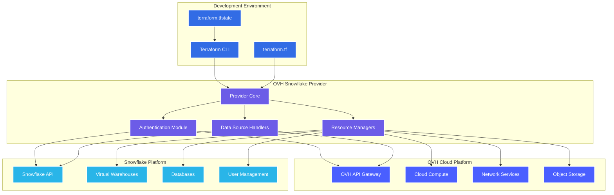
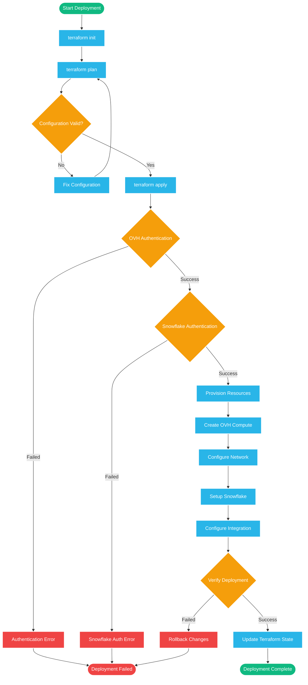
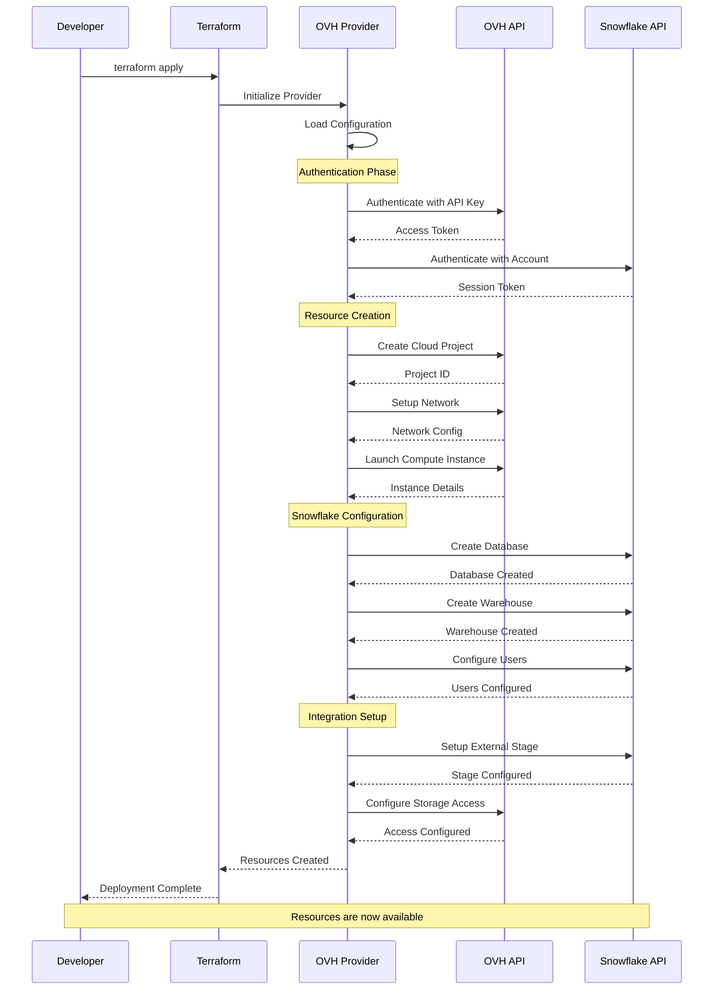
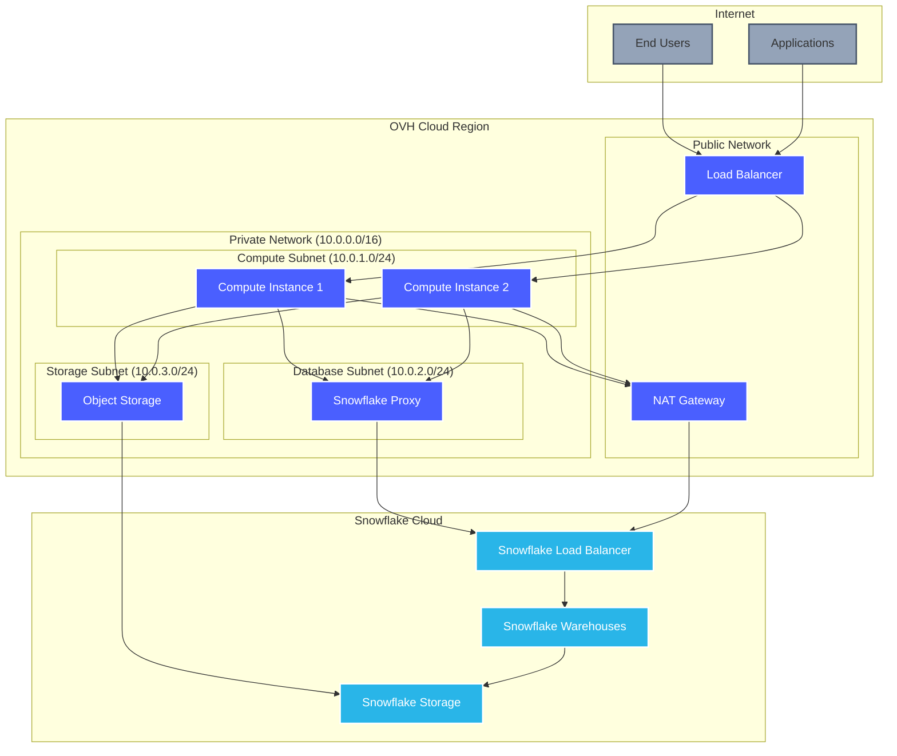
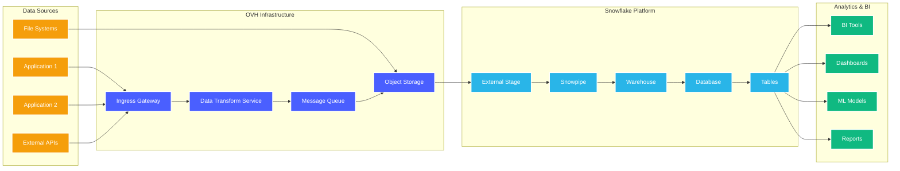

# Architecture Diagrams

This page demonstrates the enhanced Mermaid diagram capabilities with transparent backgrounds and full dark/light mode support. All diagrams automatically adapt to your theme preference.

## Provider Architecture Overview

The following diagram shows how the OVH Snowflake Terraform Provider integrates with both OVH Cloud and Snowflake services:

## Deployment Workflow

This flowchart illustrates the typical deployment process when using the provider:

## API Interaction Sequence

The sequence diagram below shows how the provider interacts with both OVH and Snowflake APIs:

## Network Architecture

This diagram shows the network topology created by the provider:

## Resource Lifecycle

This Gantt chart shows the typical timeline for resource provisioning:

```mermaid
gantt
    title OVH Snowflake Resource Provisioning Timeline
    dateFormat X
    axisFormat %s
    
    section Infrastructure
    Initialize Provider     :done, init, 0, 5s
    Create Cloud Project    :done, project, after init, 10s
    Setup Network          :done, network, after project, 15s
    Launch Compute         :active, compute, after network, 30s
    Configure Storage      :storage, after compute, 20s
    
    section Snowflake
    Authenticate           :done, sf-auth, 0, 8s
    Create Database        :active, database, after sf-auth, 25s
    Create Warehouse       :warehouse, after database, 20s
    Configure Users        :users, after warehouse, 15s
    
    section Integration
    Setup External Stage   :integration, after storage, 10s
    Configure Permissions  :permissions, after users, 10s
    Validate Connection    :validation, after permissions, 5s
    
    section Finalization
    Update State          :state, after validation, 5s
    Generate Outputs      :outputs, after state, 3s
```

## Data Flow Architecture

This diagram illustrates how data flows through the integrated system:

## Features

All diagrams on this page feature:

- **🎨 Transparent Backgrounds**: No white boxes that clash with dark mode
- **🌓 Dynamic Theming**: Automatic adaptation to light/dark mode preferences
- **📱 Responsive Design**: Optimized for all screen sizes
- **⚡ Smooth Animations**: Subtle entrance animations as you scroll
- **🎯 Professional Styling**: Consistent with OVH and Snowflake brand colors
- **♿ Accessibility**: High contrast support and reduced motion options

## Theme Support

Toggle between light and dark modes using the theme switcher in the navbar to see how all diagrams seamlessly adapt their colors while maintaining transparency and readability.